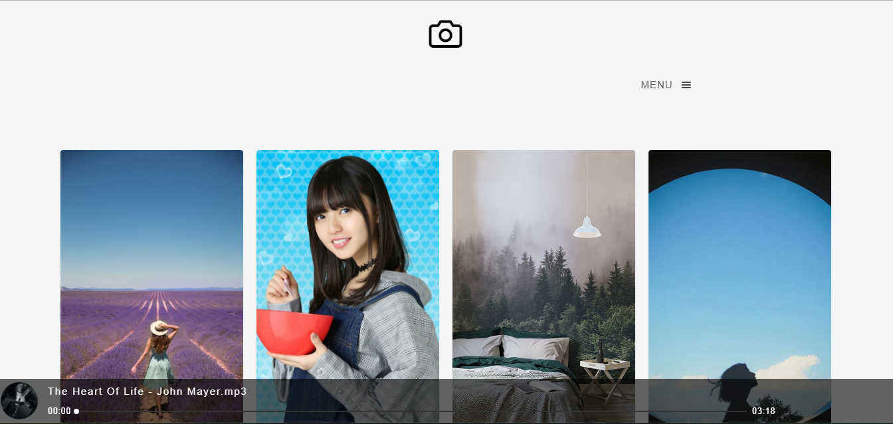
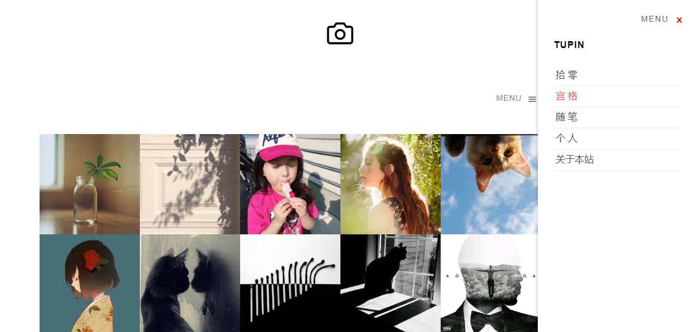
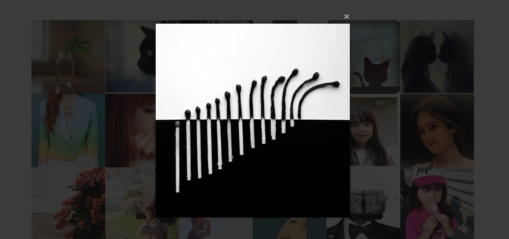
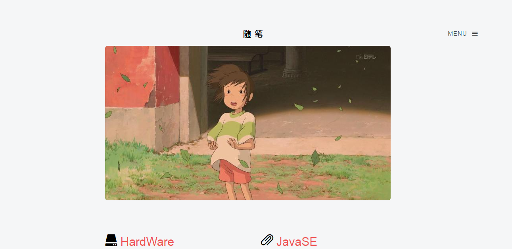
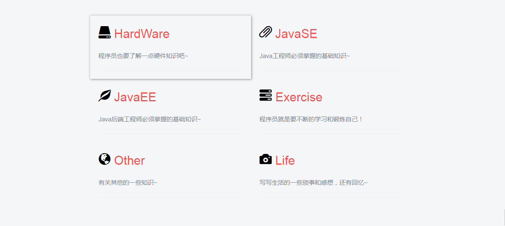
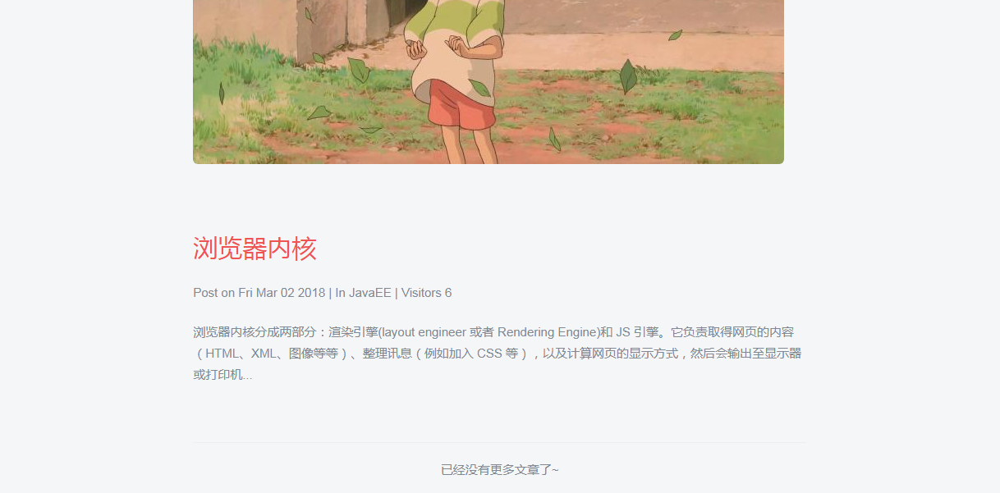
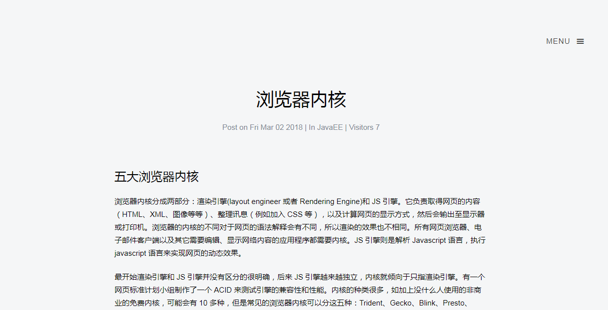
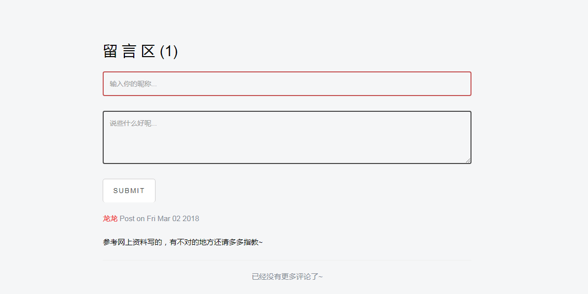

# Tupin - A Blog Web base on SpringBoot

基于SpringBoot搭建的个人博客网站，首页支持异步加载图片瀑布流，支持小清新相册翻页展示，支持基于Markdown语法的博客的发布，支持评论和留言功能

## 搭建环境

* Spring Boot + JPA + Thymeleaf + Maven

* JS插件
  - Magnific Popup.js：图片弹出层插件
  - Way Points.js：滚动监听插件
  - Salvattore.js：瀑布流布局插件
  - make.js：Markdown网页转换插件

## View

**瀑布流图片展示，可点击放大查看**

**宫格图片动态展示，可点击放大查看**

**博客主题分类**

**博客内容与留言板块**

